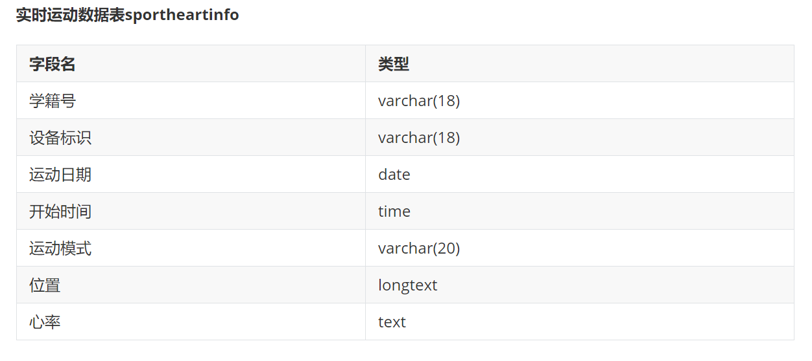
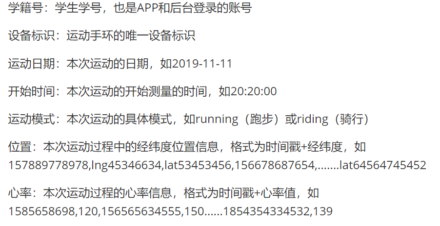
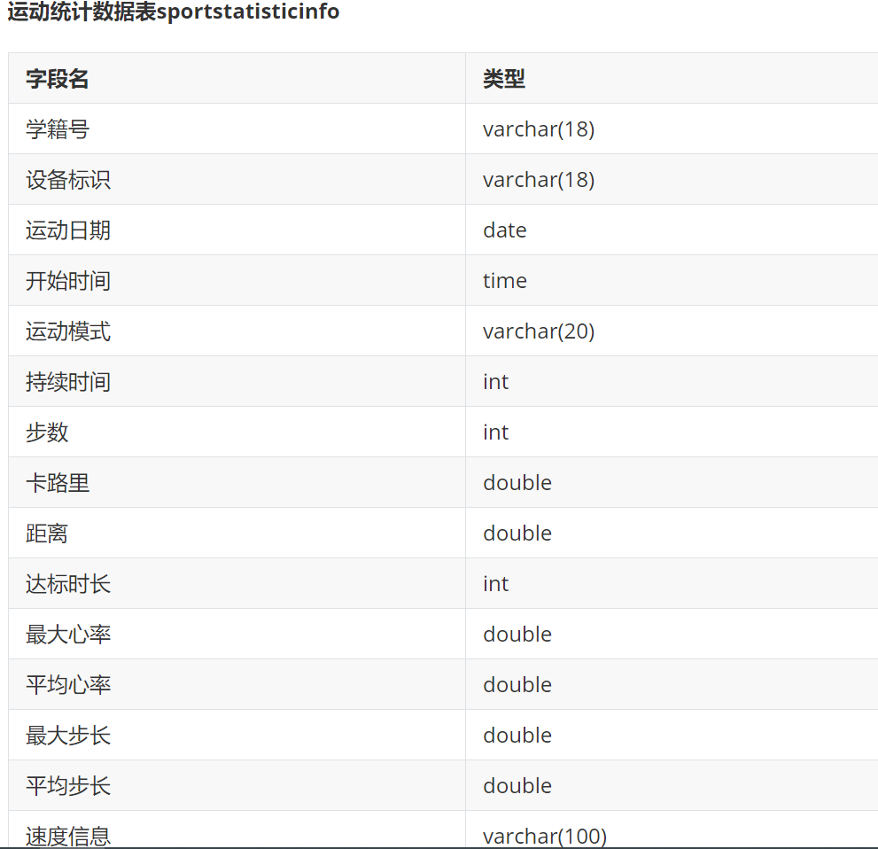
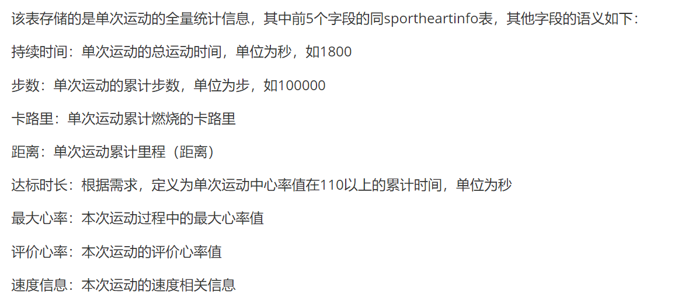
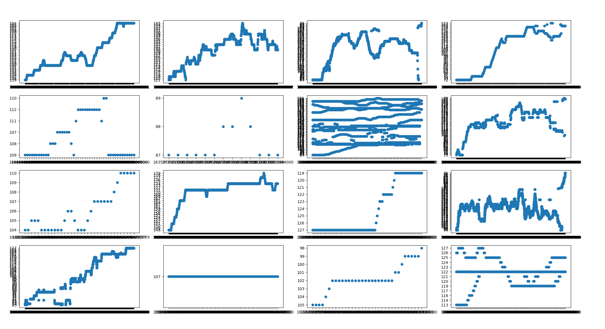

# 毕业设计：阳光长跑作弊检测系统
## 数据集
由于数据量较大，直接从csv读取花费较多时间，所以把数据导入到mariadb数据库
### sportheartinfo



```
"学籍号","设备标识","运动日期","开始时间","运动模式","位置","心率"
"15669955680","d61a128c6585","8/10/2021","14:37:37","indoor","No Data","1633675057000,63,1633675058000,63,1633675059000,63,1633675060000,63,1633675061000,63,1633675062000,63,1633675063000,63,1633675064000,63,1633675065000,63,1633675066000,63,1633675067000,63,1633675068000,63,1633675069000,63,1633675070000,63,1633675071000,63,1633675072000,63,1633675073000,63,1633675074000,63,1633675075000,63,1633675076000,63,1633675077000,63,1633675078000,63,1633675079000,63,1633675080000,63,1633675081000,63,1633675082000,63,1633675083000,63,1633675084000,63,1633675085000,63,1633675086000,63,1633675087000,63,1633675088000,63,1633675089000,63,1633675090000,63,1633675091000,63,1633675092000,63,1633675093000,63,1633675094000,63,1633675095000,63,1633675096000,63,1633675097000,63,1633675098000,63,1633675099000,63,1633675100000,63,1633675101000,63,1633675102000,63,1633675103000,63,1633675104000,63,1633675105000,63,1633675106000,63,1633675107000,63,1633675108000,63,1633675109000,63,1633675110000,63,1633675111000,63,1633675112000,63,1633675113000,63,1633675114000,63,1633675115000,63,1633675116000,63,1633675117000,63,1633675118000,63,1633675119000,63,1633675120000,63,1633675121000,63,1633675122000,63,1633675123000,63,1633675124000,63,1633675125000,63,1633675126000,63,1633675127000,63,1633675128000,63,1633675129000,63,1633675130000,63,1633675131000,63,1633675132000,63,1633675133000,63,1633675134000,63,1633675135000,63,1633675136000,63,1633675137000,63,1633675138000,63,1633675139000,63,1633675140000,63,"
```
每个学生多台设备，测试多项数据

### sportstatisticinfo


```
"学籍号","设备标识","运动日期","开始时间","运动模式","持续时间","步数","卡路里","距离","达标时长","最大心率","平均心率","最大步长","平均步长","速度信息"
"""201613050611""","d61a128c6585","7/1/2021","10:40:25","running","1439","0","0","0","0","0","100","0","0","null"
```

### 数据初步展示



### 数据过滤
通过随机16条随机抽取的数据散点图看，只有部分噪声较小的数据达标。

过滤指标
1. 采集次数不少于60
2. 相同时间段有重复采集心率的数据视为有噪声，噪声过大的数据直接废弃
3. 心率一直不变视为脏数据
4. 出现数据值太少
5. 旧数据过滤，按照学号来，2021/09
### 数据预处理
1. 清理噪声，考虑使用取平均值
2. 数据维度均一化
### 开发
### 错误
1. 字符串自动出现双引号
csc文件的数据前80行数据使用了三个引号